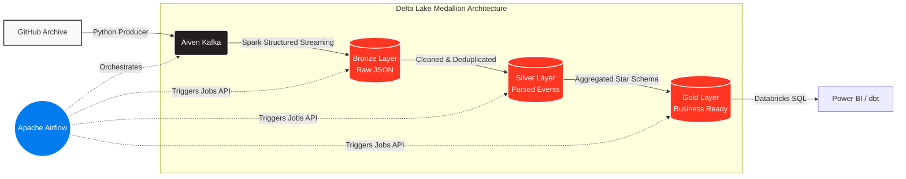

# GitHub Events — Real-Time Data Engineering Pipeline

An end-to-end, production-style data pipeline that streams public GitHub activity
through **Kafka** into a **Delta Lake medallion** on **Databricks**, orchestrated by
**Airflow**, modeled with **dbt**, and visualized in **Power BI**.



| Concern        | Tool                                   |
|----------------|----------------------------------------|
| Source         | GH Archive (`data.gharchive.org`)      |
| Messaging      | Aiven Kafka (managed, SSL auth)        |
| Processing     | Spark Structured Streaming (Databricks)|
| Storage        | Delta Lake — Bronze / Silver / Gold    |
| Orchestration  | Apache Airflow (Docker, single node)   |
| Transformation | dbt (optional, SQL path to Gold)       |
| BI             | Power BI (Databricks SQL connector)    |

---

## Repository layout

```
github_events_pipeline/
├── producer/          # GH Archive -> Aiven Kafka (Python)
├── certs/             # Aiven SSL certs (gitignored) — see certs/README.md
├── databricks/        # Bronze/Silver/Gold notebooks + setup guide
├── airflow/           # Minimal Docker Airflow + orchestration DAG
├── dbt/               # SQL models for the Gold layer (alternative to notebook 03)
└── README.md
```

---

## Quickstart

### Phase 1 — Aiven Kafka  *(done ✅ — 2 partitions, client-cert auth)*
Download `ca.pem`, `service.cert`, `service.key` from the Aiven console into `certs/`
(see [certs/README.md](certs/README.md)).

### Phase 2 — Producer (run this now)
```bash
cd producer
pip install -r requirements.txt

python test_connection.py                       # verify SSL handshake
python create_topics.py                          # create the 4 topics (2 partitions each)
python kafka_producer.py --date 2024-01-15 --hour 12 --limit 500   # smoke test
python kafka_producer.py                          # produce the previous full hour
```

### Phase 3 — Databricks (Free Edition / serverless)
Follow [databricks/README.md](databricks/README.md): convert certs → JKS, upload to a
**Unity Catalog Volume** (`/Volumes/…`), set secrets, import the three notebooks, attach
**Serverless** compute. Run **01 → 02 → 03**. (Kafka connector is preinstalled; no Maven
needed. `availableNow` is the only serverless-supported trigger — Airflow re-runs it hourly.)

### Phase 4 — Airflow
```bash
cd airflow
cp .env.example .env        # fill in Databricks host / fresh token / catalog (no cluster id on serverless)
docker compose up -d        # UI at http://localhost:8080  (admin / admin)
```
Unpause `github_events_pipeline`. It runs producer → bronze → silver → gold hourly.

### Phase 5 — dbt (optional)
```bash
cd dbt
pip install dbt-databricks
dbt run        # builds gold.* from gh_silver.events
dbt test       # runs the unique/not_null tests on event_id
```

### Phase 6 — Power BI
Get Data → **Azure Databricks** → paste the SQL Warehouse host + HTTP path → import
the `gh_gold` tables → build the dashboard (see ideas below).

---

## Data model (Gold — star schema)

```
                 ┌───────────────┐
                 │   dim_repos   │
                 │ repo_id (PK)  │
                 │ repo_name     │
                 │ contributors  │
                 └──────┬────────┘
                        │
┌──────────────┐  ┌─────┴──────────┐  ┌───────────────┐
│  dim_users   │  │  fact_events   │  │  (event_date) │
│ actor_id(PK) ├──┤ event_id (PK)  ├──┤  date grain   │
│ actor_login  │  │ actor_id (FK)  │  └───────────────┘
│ repos_touched│  │ repo_id  (FK)  │
└──────────────┘  │ event_type     │
                  │ event_timestamp│
                  └────────────────┘

Pre-aggregated marts:  agg_daily_activity, top_repos_by_stars, developer_activity
```

| Table                  | Grain                              | Powers                         |
|------------------------|------------------------------------|--------------------------------|
| `fact_events`          | one row per event                  | drill-down, custom measures    |
| `dim_repos`            | one row per repo                   | repo slicers                   |
| `dim_users`            | one row per actor                  | developer slicers              |
| `agg_daily_activity`   | date × repo × event_type           | activity trend charts          |
| `top_repos_by_stars`   | repo                               | "trending repos" leaderboard   |

**Dashboard ideas:** trending repos (stars/day), push-event heatmap by hour,
PR activity trend, top developers leaderboard, event-type mix over time.

---

## Best practices included

- **Exactly-once / idempotency** — Spark checkpoints store Kafka offsets; Silver uses
  `MERGE` on `event_id`; the producer uses idempotent writes (`enable.idempotence`).
- **Partitioning** — Bronze by `ingestion_date`; Silver by `event_date` + `event_type`;
  Gold facts/aggregates by `event_date` → query pruning + cheap incremental loads.
- **Schema evolution** — Bronze stores raw JSON (never breaks on new fields);
  Silver applies an *explicit* schema; `mergeSchema` handles additive changes.
- **Cost control** — runs entirely on **serverless** (Free Edition); `Trigger.availableNow`
  drains Kafka and stops (no 24/7 stream); `maxOffsetsPerTrigger` backpressure; `OPTIMIZE` compaction.
- **Secrets hygiene** — certs gitignored; Databricks secret scopes; no creds in code.
- **Incremental everywhere** — Silver/Gold only process recent partitions, not full history.

